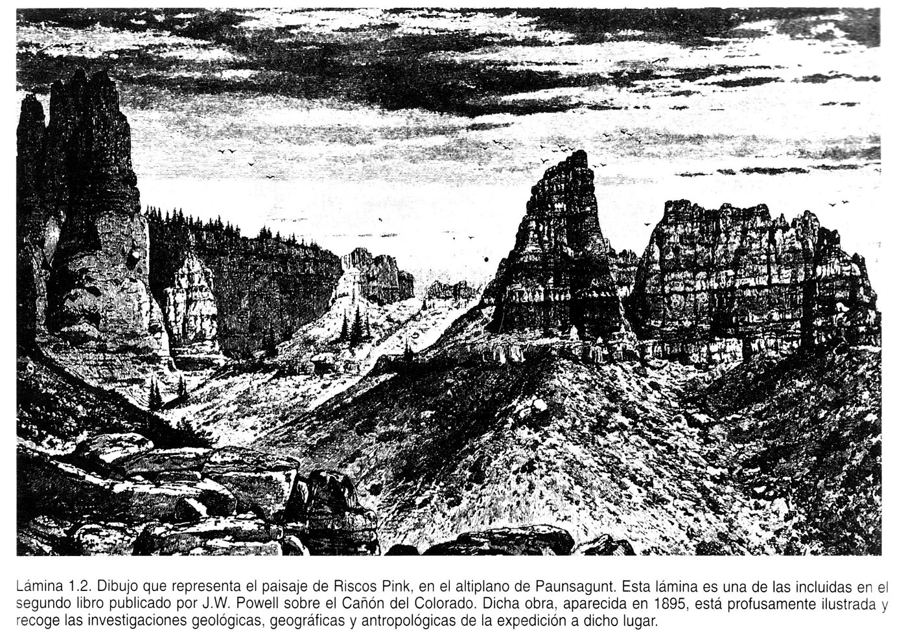
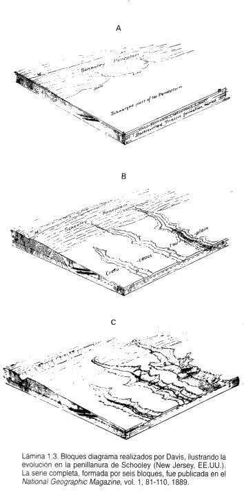
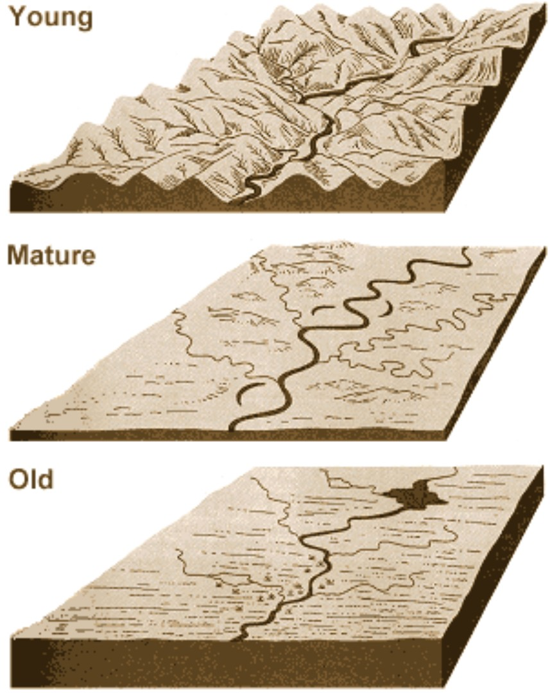
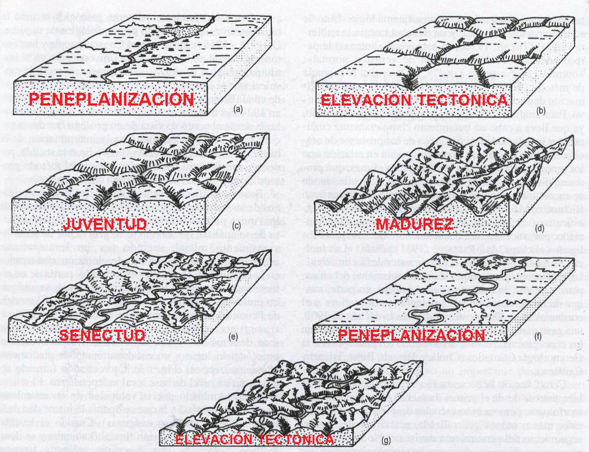
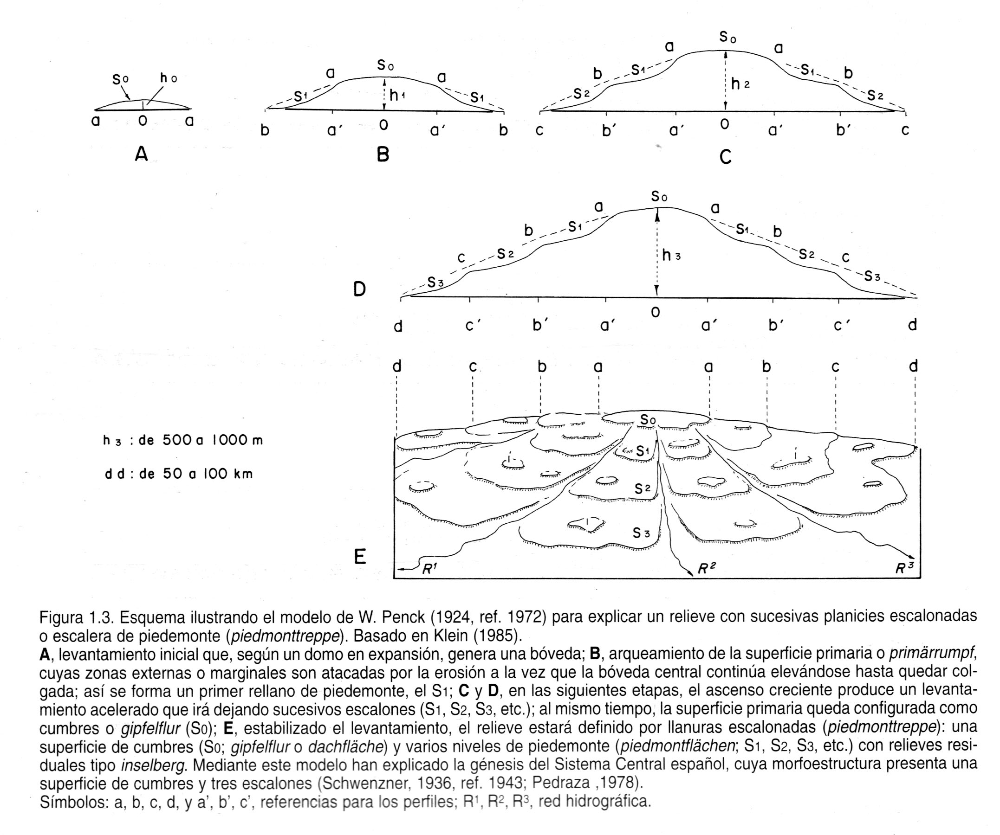

```{r setup, include=FALSE}
knitr::opts_chunk$set(echo = FALSE)
```

## Introducción

* En sentido estricto, la geomorfología es la __ciencia que estudia las formas terrestres__

* En esta definición se recurre al objeto de la Geomorfología, no al quehacer propio ni “sugiere” los métodos y técnicas que habrían de emplearse en su ejercicio

## Introducción (cont.)

* En sentido amplio, es la ciencia que se ocupa de la __descripción e interpretación__ de las características del relieve terrestre

* Aquí se incluyen elementos más amplios, como la necesidad de __buscar causas__ (interpretar) que expliquen las formas y su distribución

* La __interpretación exige estudiar procesos__, mediante técnicas específicas cuantitativas y cualitativas

## Epistemología

* Principio de "superposición de estratos", propuesto por Steno (1638-1686) en el siglo XVII, del cual se derivan dos aportaciones:

    * Los estratos, o capas de rocas, se depositan de __horizontalmente__
    
    * La capa más baja es __más antigua__

## Epistemología (cont.)

* Leonardo da Vinci (1452-1519) propuso en que los materiales aluviales del valle del Po, en Italia, habían tomado “como mínimo” unos __200,000 años en depositarse__
    
* Palissy (1510-1590) y Da Vinci (1452-1519) consolidan ideas sobre la __Hidrología__ en su obra "Discours admirables de la nature des eaux et fontaines"

## Epistemología (cont.)

* __Estatismo creacionista__ y catastrofismo, entre los siglos XVII a XIX (Cuvier)

* __Uniformitarismo__ o uniformismo, actualismo y evolucionismo, s. XVIII y primera mitad XIX, con Hutton (el presente es la clave del pasado), Playfair, Lyell

## 

## 

## 

## 

## 

## Referencias

