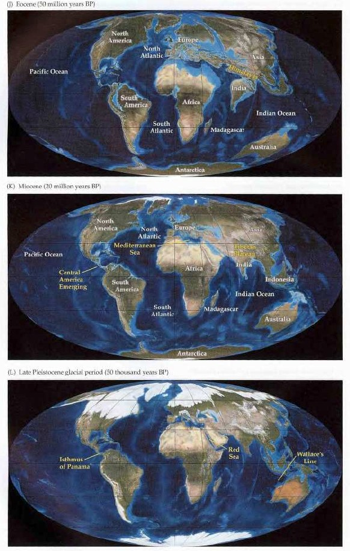
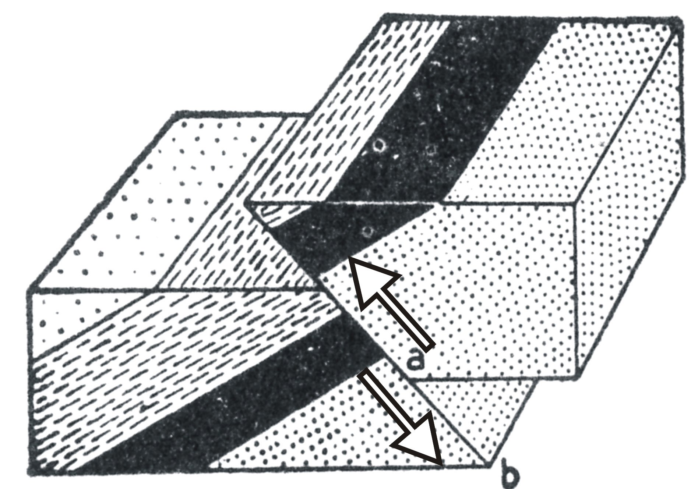

```{r setup, include=FALSE}
knitr::opts_chunk$set(echo = FALSE)
```

## Introducción

* En sentido estricto, la geomorfología es la __ciencia que estudia las formas terrestres__

* En esta definición se recurre al objeto de la Geomorfología, no al quehacer propio ni “sugiere” los métodos y técnicas que habrían de emplearse en su ejercicio

## Introducción (cont.)

* En sentido amplio, es la ciencia que se ocupa de la __descripción e interpretación__ de las características del relieve terrestre

* Aquí se incluyen elementos más amplios, como la necesidad de __buscar causas__ (interpretar) que expliquen las formas y su distribución

* La __interpretación exige estudiar procesos__, mediante técnicas específicas cuantitativas y cualitativas

## Epistemología

* Principio de "superposición de estratos", propuesto por Steno (1638-1686) en el siglo XVII, del cual se derivan dos aportaciones:

    * Los estratos, o capas de rocas, se depositan de __horizontalmente__
    
    * La capa más baja es __más antigua__

## Epistemología (cont.)

* Leonardo da Vinci (1452-1519) propuso en que los materiales aluviales del valle del Po, en Italia, habían tomado “como mínimo” unos __200,000 años en depositarse__
    
* Palissy (1510-1590) y Da Vinci (1452-1519) consolidan ideas sobre la __Hidrología__ en su obra "Discours admirables de la nature des eaux et fontaines"

## Epistemología (cont.)

* __Estatismo creacionista__ y catastrofismo, entre los siglos XVII a XIX (Cuvier)

* __Uniformitarismo__ o uniformismo, actualismo y evolucionismo, s. XVIII y primera mitad XIX, con Hutton (el presente es la clave del pasado), Playfair, Lyell

## 

## 

## 

## 

## 

## 

## 

## 

## Epistemología (cont.)

* Deriva de los continentes

* Expansión del fondo oceánico

* Tectónica de placas

## 

## 

## 

## 

## 

## 

## 

## 

## 

## 

## 

## 

## 

## 

## 

## 

## 

## 

## 

## 

## Minerales

* Según Tarbuck y Lutgens (2000), la definición de mineral es muy controvertida, pero la más aceptada es «__cualquier sólido inorgánico__ (excepcionalmente orgánico) __natural__ que generalmente posee una __estructura interna__ ordenada y una __composición química__ que puede variar según unos límites pre-establecidos»

## Minerales (cont.)

* Por lo tanto la definición se puede descomponer de la siguiente manera:

    * Debe aparecer de forma natural
    
    * Debe ser inorgánico
    
    * Debe ser un sólido
    
    * Debe poseer una estructura interna ordenada, es decir, sus átomos deben estar dispuestos según modelo definido
    
    * Debe tener una composición química definida, variable según unos límites convencionalmente aceptados

## Minerales (cont.)

* Según esta definición:

    * Los diamantes sintéticos hechos por los químicos para su incorporación en la punta de brocas y sondas especializadas, no son minerales porque fueron hechos por el ser humano
    
    * Es mineral el hielo, pero no el agua líquida
    
    * El petróleo no sería un mineral por presentarse siempre en estado líquido
    
    * La materia orgánica, tales como huesos, hojarasca, troncos, no son minerales. Ahora bien, si se han convertido en fósiles, su composición podría contener minerales (los fósiles son restos vivos mineralizados)

## Minerales (cont.)

* Silicatados

    * Olivino
    
    * Piroxenos
    
    * Hornblenda
    
    * Micas
    
    * Feldespatos
    
    * Cuarzo

## 

## Minerales (cont.)

* No silicatados

    * Óxidos
    
    * Sulfuros
    
    * Sulfatos
    
    * Elementos nativos
    
    * Haluros
    
    * Carbonatos
    
    * Hidróxidos
    
    * Fosfatos

## 

## Rocas

* Las rocas son cualquier material conformado naturalmente, consolidado o no (pero no suelo), compuesto de dos o más minerales, y ocasionalmente de uno, que tiene un cierto grado de constancia mineral y química

## Rocas (cont.)

* Ígnea o magmática: una de las tres divisiones en que se clasifican las rocas (las otras son sedimentaria y metamórfica)

    * Procede del material fundido denominado magma
    
    * Este material es capaz de “intruirse” o “extruirse” formando, rocas intrusivas o extrusivas, respectivamente

## Rocas (cont.)
    
* La intrusión supone el emplazamiento gradual de magma en rocas pre-existentes (llamadas también “roca caja”), convirtiéndose la masa solidificada en roca intrusiva

* Las rocas magmáticas extrusivas, suponen la emisión de lava de forma súbita, tal y como ocurre en los volcanes hoy en día. Dicha emisión puede ocurrir de forma subaérea (por encima del foco de emisión se encuentra la atmósfera) o subacuática (por encima del foco de emisión hay una masa de agua)

## 

## 

## 

## Rocas (cont.)


## Introducción a procesos

* Los paisajes terrestres se componen principalmente de:

    * Vertientes limitadas por canales
    
    * Cimas mayoritariamente convexas hacia arriba
    
    * Regolito, alterita, en la superficie, típicamente sobre roca inalterada

## Introducción a procesos (cont.)

* Las vertientes comúnmente producen sedimentos transportados por el __agua__

* El __agua__ circula a través de una red típicamente dendrítica, la cual divide el paisaje en cuencas

* El límite externo de los paisajes terrestres es la costa, desde comienza la geomorfología submarina

## Fuentes cartográficas dominicanas sobre geología y geomorfología


## Referencias

