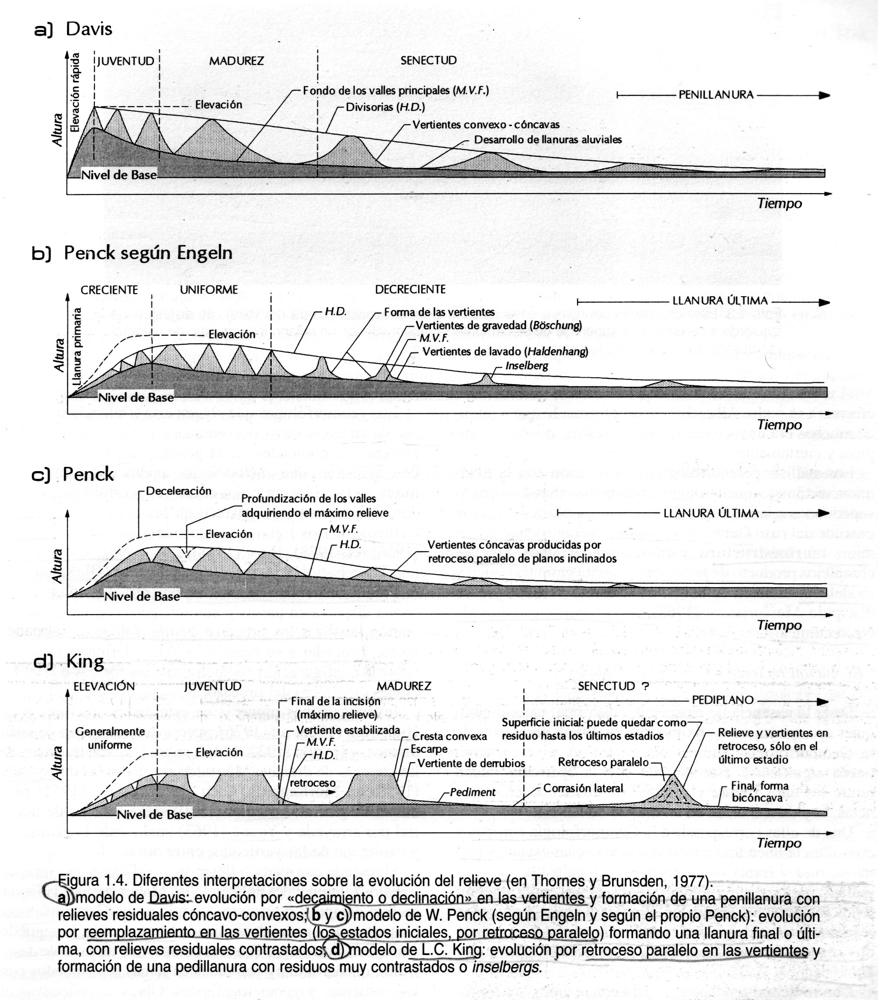
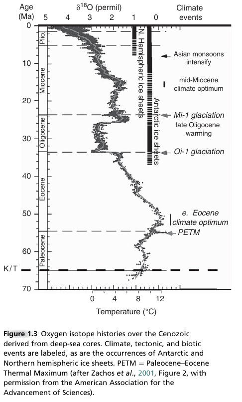
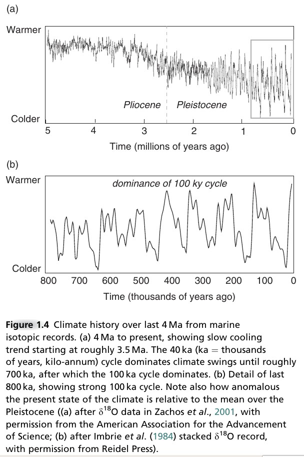

```{r setup, include=FALSE}
knitr::opts_chunk$set(echo = FALSE)
```

# Introducción

## 

* En sentido estricto, la geomorfología es la __ciencia que estudia las formas terrestres__

* En esta definición se recurre al objeto de la Geomorfología, no al quehacer propio ni “sugiere” los métodos y técnicas que habrían de emplearse en su ejercicio

## 

* En sentido amplio, es la ciencia que se ocupa de la __descripción e interpretación__ de las características del relieve terrestre

* Aquí se incluyen elementos más amplios, como la necesidad de __buscar causas__ (interpretar) que expliquen las formas y su distribución

* La __interpretación exige estudiar procesos__, mediante técnicas específicas cuantitativas y cualitativas

# Epistemología

##

* Principio de "superposición de estratos", propuesto por Steno (1638-1686) en el siglo XVII, del cual se derivan dos aportaciones:

    * Los estratos, o capas de rocas, se depositan de __horizontalmente__
    
    * La capa más baja es __más antigua__

##

* Leonardo da Vinci (1452-1519) propuso en que los materiales aluviales del valle del Po, en Italia, habían tomado “como mínimo” unos __200,000 años en depositarse__
    
* Palissy (1510-1590) y Da Vinci (1452-1519) consolidan ideas sobre la __Hidrología__ en su obra "Discours admirables de la nature des eaux et fontaines"

##

* __Estatismo creacionista__ y catastrofismo, entre los siglos XVII a XIX (Cuvier)

* __Uniformitarismo__ o uniformismo, actualismo y evolucionismo, s. XVIII y primera mitad XIX, con Hutton (el presente es la clave del pasado), Playfair, Lyell

## 
@pedraza1996geomorfologia

## 

## 

## 

## 
@pedraza1996geomorfologia

## 

## 

## 
@pedraza1996geomorfologia

## Hipótesis y teorías relevantes de finales del s. XIX y el XX

* Deriva de los continentes

* Expansión del fondo oceánico

* Tectónica de placas

# Tectónica de placas

## 
@tarbuck2005ciencias

## 
@lomolino2006biogeography

## 
@tarbuck2005ciencias

## 
@lomolino2006biogeography

## 
@lomolino2006biogeography

## 
@lomolino2006biogeography

## 

## 

## 

## 

# Minerales

##

* Según Tarbuck y Lutgens (2000), la definición de mineral es muy controvertida, pero la más aceptada es «__cualquier sólido inorgánico__ (excepcionalmente orgánico) __natural__ que generalmente posee una __estructura interna__ ordenada y una __composición química__ que puede variar según unos límites pre-establecidos»

##

* Por lo tanto la definición se puede descomponer de la siguiente manera:

    * Debe aparecer de forma natural
    
    * Debe ser inorgánico
    
    * Debe ser un sólido
    
    * Debe poseer una estructura interna ordenada, es decir, sus átomos deben estar dispuestos según modelo definido
    
    * Debe tener una composición química definida, variable según unos límites convencionalmente aceptados

##

* Según esta definición:

    * Los diamantes sintéticos hechos por los químicos para su incorporación en la punta de brocas y sondas especializadas, no son minerales porque fueron hechos por el ser humano
    
    * Es mineral el hielo, pero no el agua líquida
    
    * El petróleo no sería un mineral por presentarse siempre en estado líquido
    
    * La materia orgánica, tales como huesos, hojarasca, troncos, no son minerales. Ahora bien, si se han convertido en fósiles, su composición podría contener minerales (los fósiles son restos vivos mineralizados)

##

* Silicatados

    * Olivino
    
    * Piroxenos
    
    * Hornblenda
    
    * Micas
    
    * Feldespatos
    
    * Cuarzo

## 

##

* No silicatados

    * Óxidos
    
    * Sulfuros
    
    * Sulfatos
    
    * Elementos nativos
    
    * Haluros
    
    * Carbonatos
    
    * Hidróxidos
    
    * Fosfatos

## 

# Rocas

##

* Las rocas son cualquier material conformado naturalmente, consolidado o no (pero no suelo), compuesto de dos o más minerales, y ocasionalmente de uno, que tiene un cierto grado de constancia mineral y química

##

* Ígnea o magmática: procede del material fundido denominado magma.

* Este material es capaz de "intruirse" o "extruirse" formando, rocas intrusivas o extrusivas, respectivamente

##
    
* La intrusión supone el emplazamiento gradual de magma en rocas pre-existentes (llamadas también "roca caja"), convirtiéndose la masa solidificada en roca intrusiva

* Las rocas magmáticas extrusivas, suponen la emisión de lava de forma súbita, tal y como ocurre en los volcanes hoy en día. Dicha emisión puede ocurrir de forma subaérea (por encima del foco de emisión se encuentra la atmósfera) o subacuática (por encima del foco de emisión hay una masa de agua)

## 

## 

## 

##

* Sedimentaria: roca resultante de la consolidación de sedimento suelto que se acumula en capas.

* Los tipos más comunes son:

    * Clásticas o detríticas (como el conglomerado, la arenisca): compuesta de fragmentos procedentes de otras rocas formados mecánicamente y transportados desde el área fuente por medio del agua, el hielo o el aire

##

* Químicas (por ejemplo, la sal, el yeso, algunas calizas): se forman por precipitación de minerales desde una solución
    
* Orgánicas (algunas calizas, el carbón, el petróleo): compuestas de restos muertos de seres vivos o sus secreciones

## 

## 

## 

## 

## 

## 

## 

##

* Metamórfica: resultante de un proceso de sobrepresión y sobrecalor natural que se aplica sobre una masa rocosa pre-existente de roca magmática o sedimentaria y que como consecuencia sus minerales cambian sus propiedades químicas y físicas (se reorganizan, re-cristalizan, etc.)

## 

## 

## 

# Geomorfología tectónica

## 
@tarbuck2005ciencias

## 

## 

## 
@tarbuck2005ciencias

## 

## 
@tarbuck2005ciencias

## 

## 

## 
@tarbuck2005ciencias

## 

## 

## 

# Estructura de la geomorfología

## 
@gutierrez2008geomorfologia

# Introducción a procesos

## Vistazo general

* Los paisajes terrestres se componen principalmente de:

    * Vertientes limitadas por canales
    
    * Cimas mayoritariamente convexas hacia arriba
    
    * Regolito, alterita, en la superficie, típicamente sobre roca inalterada

##

* Las vertientes comúnmente producen sedimentos transportados por el __agua__

* El __agua__ circula a través de una red típicamente dendrítica, la cual divide el paisaje en cuencas

* El límite externo de los paisajes terrestres es la costa, desde comienza la geomorfología submarina

## Principios

* __Regla de conservación__ (...que no de la naturaleza, que mal la conservamos)

    * La __tasa de cambio__ de [e.g. "la masa de arena o agua", "calor"] en un volumen definido __es igual__ la tasa a la cual ésta es __producida__ dentro de dicho espacio, __más__ la tasa a la cual es __introducida__ dentro del volumen, __menos__ la tasa a la cual se __pierde__ fuera de sus límites" [@anderson2010geomorphology]

## 

##

* Reglas de transporte. Intervienen la __gravedad, tracción y tensión__

* Tamaño de los eventos y frecuencia.

    * Los procesos geomorfológicos dependen comúnmente del __tiempo atmosférico__

    * ¿Cuál es la importancia relativa de los eventos diarios respecto de otros que ocurren con menor frecuencia?
    * Se __compensa__ la rareza/intensidad de un evento con su trabajo geomorfológico 

## 

## 

## 

##

* En este contexto, el __uniformitarismo sigue guiando a la geomorfología__

* Sin embargo, __las tasas de los procesos cambian en el tiempo__, desde segundos a millones de años

* Incluso __la dominancia__ de un proceso sobre otro __ha cambiado__

## ¿Qué dirige los procesos geomorfológicos?

* La Tierra se enfría por conducción y convección de su calor interior a razón de __40 mW/m<sup>2</sup>__

* Del interior de la Tierra __importa más el motor propulsor de la tectónica de placas__ que su disipación de calor por conducción y convección

##

* La tectónica de placas tiene relevancia para la geomorfología, puesto que condiciona las __tasas de levantamiento y deformaciones__ de amplias dimensiones (además de terremotos)

* Las __elevaciones__ impulsan, por energía potencial, el __trabajo geomorfológico__: los materiales son transportados vertiente abajo, hasta encontrar el nivel de base (generalmente el del mar)

##

* La Tierra recibe en su superficie __1370 W/m<sup>2</sup> por radiación solar__

* Por lo tanto, la __mayor parte de la energía que dirige el sistema de la superficie de la Tierra proviene del Sol__

* La __distribución desigual__ de la radiación, y el hecho de que __la Tierra rota__, dirige la __circulación atmosférica__

* La radiación también dirige la __evaporación__, que luego __precipita__ en forma de lluvia o nieve

##

En resumen

* La __tectónica__ convierte calor (del interior de la Tierra) en energía potencia para levantar las rocas respecto del nivel del mar

* La __atmósfera__ igualmente convierte el calor generado por la radiación solar sobre la superficie, en energía potencia para elevar agua (en vapor) sobre el mar en un ciclo hidrológico de mucha más corta duración que la tectónica

## Temperatura superficial de la Tierra

* ¿Por qué este es el __"planeta agua"__?

* El agua líquida es estable en un __rango de temperaturas y presiones bastante estrecho__

* La temperatura media del planeta es __15°C__, pero sin atmófera sería de __-18°C__ (255K)

* Gases de la atmósfera (H<sub>2</sub>O, CO<sub>2</sub>, CH<sub>4</sub>, O<sub>2</sub>, O<sub>3</sub>) absorben energía de la __longitud de onda infrarroja__, pero dejan pasar otras radiaciones

* Estos gases mantienen la temperatura del planeta muy por encima del valor que tendría en ausencia de atmósfera

## 
@anderson2010geomorphology

## 
https://courses.lumenlearning.com/cheminter/chapter/phase-diagram-for-water/

## Contexto climático

## 
@anderson2010geomorphology

## 
@anderson2010geomorphology

## 
@anderson2010geomorphology

# Fuentes cartográficas dominicanas sobre geología y geomorfología

## 

* [Mapa geológico escala 1:250,000 en servidor WMS](https://geofis.xyz/lm/index.php/view/map/?repository=geologicoocoagpkg&project=geologico_gpkg)

* [KMZ del Mapa geológico escala 1:250,000](https://geografiafisica.org/sem201901/geo112/mapas/pais/)

* [Web del Servicio Geológico Nacional (SGN)](https://sgn.gob.do)

    * [Mapas geológicos escala 1:50,000 y memorias](https://sgn.gob.do/images/mapas/cartog_geologica_sgn/cgeo_rd/)
    
    * [Mapas geomorfológicos escala 1:100,000](https://sgn.gob.do/images/mapas/cartog_geomorfologica_sgn/cg_rd/)
    
    * [Mapa geológico escala 1:250,000](https://sgn.gob.do/images/docs/mapa_geologico.pdf)


# Referencias

##